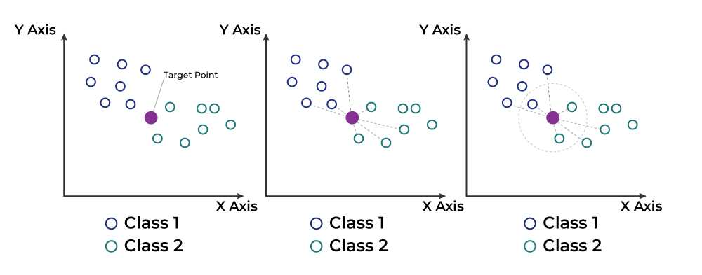
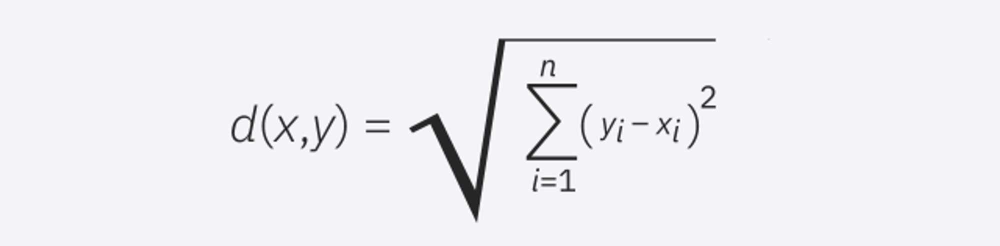
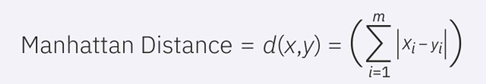
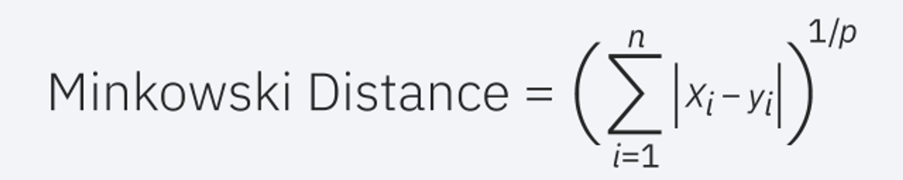
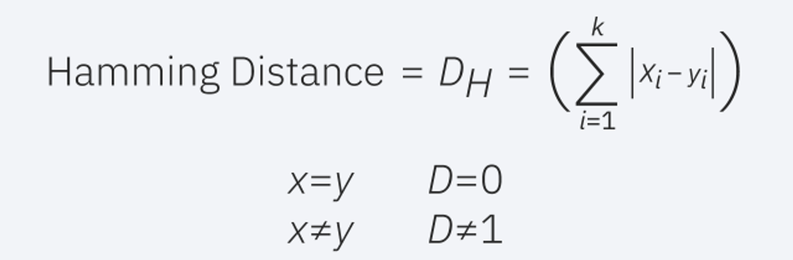

# KNN

The k-nearest neighbors (KNN) algorithm is a non-parametric supervised learning classifier that uses proximity to make classifications or predictions about the grouping of an individual data point. It is one of the most popular and straightforward classifiers for classification and regression used in machine learning today.

## Functioning in Classification

For classification problems, a class label is assigned based on a majority vote, meaning the label that appears most frequently around a given data point is used. While this is technically considered "plurality voting," the term "majority vote" is more commonly used in the literature. The distinction between these terminologies is that "majority vote" technically requires more than 50%, which mainly works when there are only two categories. When you have multiple classes, for example, four categories, you don't necessarily need 50% of the votes to reach a conclusion about a class; you could assign a class label with a vote greater than 25%.

## Distance Metrics

**Determine Your Distance Metrics**

To identify which data points are closest to a given query point, you need to calculate the distance between the query point and other data points. These distance metrics help form decision boundaries that divide the query points into different regions. You will often see decision boundaries visualized with [Voronoi diagrams](https://www.abc.es/ciencia/abci-diagrama-voronoi-forma-matematica-dividir-mundo-201704241101_noticia.html).

**Euclidean Distance (p=2):** This is the most commonly used distance measure and is limited to real-valued vectors. Using the following formula, it measures a straight line between the query point and the other point being measured.

**Manhattan Distance (p=1):** This is another popular distance metric that measures the absolute difference between two points. It is also known as taxicab distance or city block distance, as it is often visualized with a grid, illustrating how one might navigate from one direction to another through city streets.

**Minkowski Distance**: This distance measure is the generalized form of the Euclidean and Manhattan distance metrics. The parameter p in the following formula allows for the creation of other distance metrics. The Euclidean distance is represented by this formula when p is equal to two, and the Manhattan distance is denoted when p is equal to one.

**Hamming Distance:**This technique is typically used with boolean or string vectors, identifying the points where the vectors do not match. As a result, it is also referred to as the overlap metric. It can be represented by the following formula:

## Define K value

The value of k in the KNN algorithm defines how many neighbors will be checked to determine the classification of a specific query point. For example, if k=1, the instance will be assigned to the same class as its single nearest neighbor. Setting k can be a balancing act, as different values can lead to overfitting or underfitting. Lower values of k may have high variance but low bias, while higher values of k can lead to high bias and lower variance. The choice of k will largely depend on the input data, as data with more outliers or noise will likely perform better with higher values of k. Generally, it is recommended to have an odd number for k to avoid ties in classification, and cross-validation techniques can help you choose the optimal k for your dataset.

* [Elbow Method](https://en.wikipedia.org/wiki/Elbow_method_(clustering))

## Model Applications

The KNN algorithm has been used in a variety of applications, primarily within classification. Some of these use cases include:

- **Preprocesamiento de datos**: Datasets often have missing values, but the KNN algorithm can estimate these values in a process known as missing data imputation.
- **Motores de recomendación**: Using clickstream data from websites, the KNN algorithm has been used to provide automatic recommendations to users for additional content. [This research](https://www.researchgate.net/publication/267572060_Automated_Web_Usage_Data_Mining_and_Recommendation_System_using_K-Nearest_Neighbor_KNN_Classification_Method) demonstrates that a user is assigned to a particular group, and based on the behavior of users in that group, a recommendation is given. However, due to the scaling issues with KNN, this approach may not be optimal for larger datasets.
- **Finance**: KNN has also been used in various financial and economic use cases. For example, a [paper ](https://iopscience.iop.org/article/10.1088/1742-6596/1025/1/012114/pdf) shows how using KNN on credit data can help banks assess the risk of a loan to an organization or individual. It is used to determine a loan applicant's creditworthiness. Another [journal](https://www.ijera.com/papers/Vol3_issue5/DI35605610.pdf) highlights its use in stock market forecasting, foreign exchange rates, trading futures, and money laundering analyses.
- **Healthcare**: KNN has also been applied within the healthcare industry, making predictions about the risk of heart attacks and prostate cancer. The algorithm works by calculating the most probable gene expressions.
- **Pattern Recognition**: KNN has also been instrumental in identifying patterns, such as in [text classification](https://www.researchgate.net/profile/D-Adu-Gyamfi/publication/332880911_Improved_Handwritten_Digit_Recognition_using_Quantum_K-Nearest_Neighbor_Algorithm/links/5d77dca692851cacdb30c14d/Improved-Handwritten-Digit-Recognition-using-Quantum-K-Nearest-Neighbor-Algorithm.pdf) and [digit recognition](https://www.researchgate.net/profile/D-Adu-Gyamfi/publication/332880911_Improved_Handwritten_Digit_Recognition_using_Quantum_K-Nearest_Neighbor_Algorithm/links/5d77dca692851cacdb30c14d/Improved-Handwritten-Digit-Recognition-using-Quantum-K-Nearest-Neighbor-Algorithm.pdf). This has been particularly useful for identifying handwritten numbers that you might find on forms or envelopes.

## Advantages and Disadvantages

### Advantages

- **Easy to Implement**: Due to its simplicity and accuracy, KNN is one of the first classifiers a new data scientist will learn.
- **Easily Adaptable**: As new training samples are added, the algorithm adjusts to account for any new data since all training data is stored in memory.
- **Few Hyperparameters**: KNN only requires a value for k and a distance metric, which is low compared to other machine learning algorithms.

### Desventajas

- **Doesn't Scale Well:** Since KNN is a lazy algorithm, it requires more memory and data storage compared to other classifiers. This can be costly both in terms of time and money. More memory and storage will increase business expenses, and more data may take longer to compute. Although different data structures, such as Ball-Tree, have been created to address computational inefficiencies, a different classifier may be ideal depending on the business problem.
- **Curse of Dimensionality:** The KNN algorithm tends to fall victim to the curse of dimensionality, meaning it doesn't perform well with high-dimensional data inputs. This is sometimes also referred to as the peaking phenomenon, where after the algorithm reaches the optimal number of features, additional features increase the amount of classification errors, especially when the sample size is small.
- **Prone to Overfitting:** Due to the *"curse of dimensionality"*, KNN is also more prone to overfitting. While feature selection and dimensionality reduction techniques are leveraged to prevent this from happening, the value of k can also affect the model's behavior. Lower values of k may overfit the data, while higher values of k tend to "smooth out" prediction values as it is averaging values over a larger area or neighborhood. However, if the value of k is too high, then it may underfit the data.

## References

[What is the k-nearest neighbors algorithm? | IBM](https://www.ibm.com/topics/knn)
